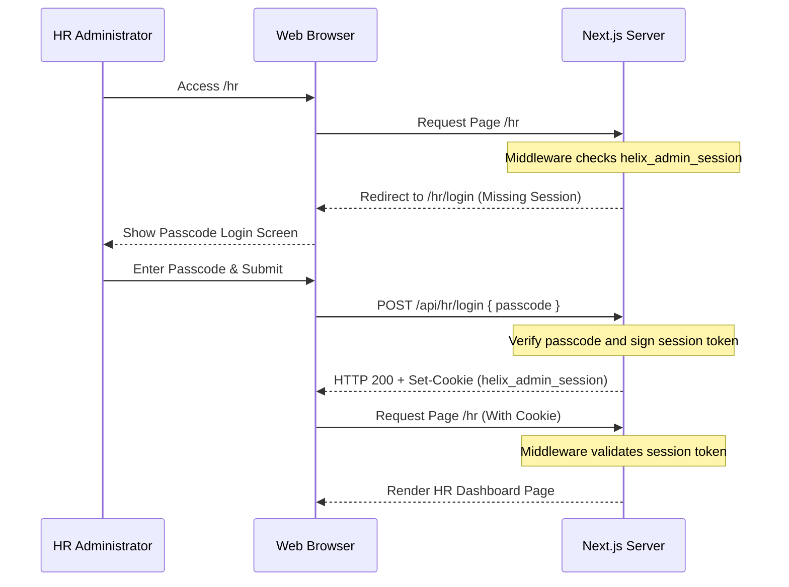

# Design Spec: HR Dashboard Authentication

Implement a passcode-based authentication mechanism to protect the HR Dashboard (`/hr` and `/api/hr/*`) from unauthorized access.

## Context
Currently, the `/hr` route and its candidate data APIs are fully public. To secure the candidate database and HR capabilities, we will restrict access to authorized administrators using a secure, environment-variable-backed passcode.

---

## 1. Security & Token Mechanism

### Environment Variables
- `ADMIN_PASSCODE`: The plain text passcode used to log in.
- `SESSION_SECRET`: A high-entropy secret string used to sign session cookies.

### Session Token
We will use a lightweight JSON payload signed using the browser-native Web Crypto API (`crypto.subtle`). This avoids node-native dependencies and runs efficiently inside Edge Middleware:
```json
{
  "role": "admin",
  "exp": 1735689600000 // expiration timestamp
}
```

### Cookie Storage
- **Name**: `helix_admin_session`
- **HttpOnly**: `true` (unaccessible via client JS)
- **Secure**: `true` (HTTPS only, relaxed on localhost)
- **SameSite**: `Lax`
- **Max-Age**: `86400` (24 hours)

---

## 2. System Flow & Routes



### Components to Create/Modify
1. **[NEW] Utility `src/lib/auth.ts`**:
   - Helper functions `signSession(passcode: string): Promise<string>` and `verifySession(token: string): Promise<boolean>` using `crypto.subtle` HMAC-SHA256 signatures.
2. **[NEW] Middleware `src/middleware.ts`**:
   - Intercepts requests to `/hr` (except `/hr/login`) and `/api/hr/*`.
   - Validates the `helix_admin_session` cookie. If invalid, redirects `/hr` to `/hr/login` and responds to `/api/hr/*` with `401 Unauthorized`.
3. **[NEW] Login Page `src/app/hr/login/page.tsx`**:
   - Dark-themed login screen matching the premium aesthetic. Displays a passcode input field and error notifications.
4. **[NEW] Login API `/api/hr/login/route.ts`**:
   - Handles passcode verification, signs the session, and sets the secure HttpOnly cookie.
5. **[NEW] Logout API `/api/hr/logout/route.ts`**:
   - Clears the `helix_admin_session` cookie.
6. **[MODIFY] HR Dashboard Header `src/app/hr/page.tsx`**:
   - Adds a "Logout" button next to the page header that triggers `/api/hr/logout` and redirects back to the main portal.

---

## 3. Verification Plan

### Automated Checks
- Unit test for signature creation and verification logic in `src/lib/__tests__/auth.test.ts`.
- Unit test verifying page redirects and unauthorized API blocks in middleware/routes.

### Manual Verification
- Attempt to navigate directly to `/hr` in a private/incognito window. Verify redirect to `/hr/login`.
- Input incorrect passcodes and verify appropriate error displays.
- Input correct passcode, verify dashboard loads, and inspect cookie attributes to ensure `HttpOnly` and `Secure` are enabled.
- Click "Logout" and ensure access is revoked.
